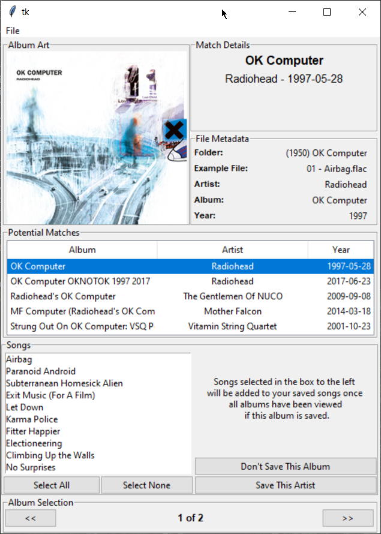

# Spotify Importer



Spotify Importer is a python application designed to help automate the process of adding local music files to your Liked Songs, Albums, and Artists on Spotify.
## Installation

Clone the repo
```bash
git clone https://github.com/mandos21/SpotifyImporter.git
```
Create a file called credentials.py in the working directory of the project and define the following two variables
```python
client_id = 'your_client_id_here'
client_secret = 'your_client_secret_here'
```

## Usage

Start the UI
```bash
python spotify_importer.py
```

File > Open to select your music directory.  

The expected structure of your files is a music folder with subdirectories containing albums that contain the songs.  If I ever get back to this project, I will include a UI element to select the directory structure of your music, but for now you should be able to modify the code to suit your needs fairly easily.

Example Structure Might Look like this:
```
D:\EXAMPLE DIRECTORY
├───(1997) OK Computer
│       01 - Airbag.flac
│       02 - Paranoid Android.flac
│       03 - Subterranean Homesick Alien.flac
│       04 - Exit Music (for a Film).flac
│       05 - Let Down.flac
│       06 - Karma Police.flac
│       07 - Fitter Happier.flac
│       08 - Electioneering.flac
│       09 - Climbing Up the Walls.flac
│       10 - No Surprises.flac
│       11 - Lucky.flac
│       12 - The Tourist.flac
│       cover.jpg
│
└───(1969) In The Court Of The Crimson King
        01 - 21st Century Schizoid Man including Mirrors.mp3
        02 - I Talk To The Wind.mp3
        03 - Epitaph including March For No Reason and Tomorrow And Tomorrow.mp3
        04 - Moonchild including The Dream and The Illusion.mp3
        05 - The Court Of The Crimson King including The Return Of The Fire Witch and The Dance Of The Puppets.mp3
        King Crimson - In The Court Of The Crimson King.m3u

```

## Contributing
Pull requests are welcome. For major changes, please open an issue first to discuss what you would like to change.

## License
[GNU GPLv3](https://choosealicense.com/licenses/gpl-3.0/)
